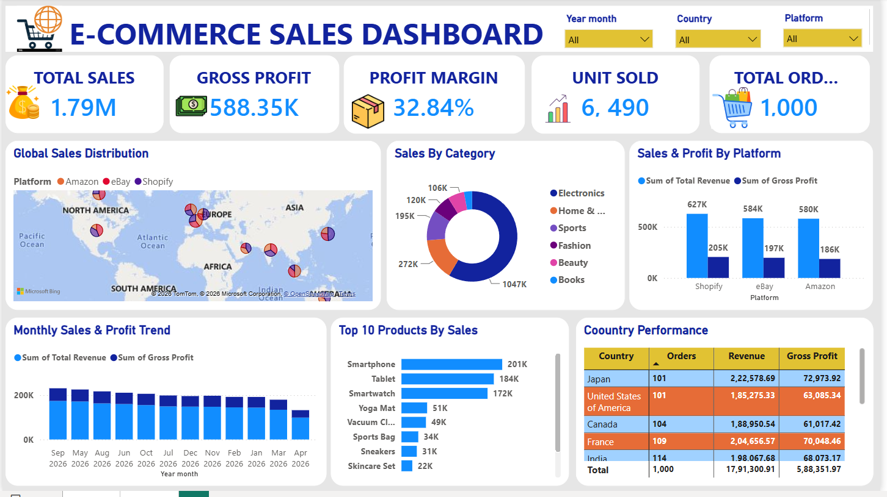

# E-Commerce Sales Dashboard – Power BI

## Project Overview

This project is an interactive **E-Commerce Sales Dashboard** created using **Microsoft Power BI**.

The dashboard is designed to analyze e-commerce sales performance, profitability, products, platforms, countries, orders, and monthly trends.

The project converts raw e-commerce sales data into an interactive and easy-to-understand business dashboard.

## Project Objectives

- Analyze overall e-commerce sales performance
- Track total sales and gross profit
- Calculate profit margin
- Analyze units sold and total orders
- Compare sales across platforms
- Analyze sales by product category
- Identify top-performing products
- Analyze country-wise performance
- Study monthly sales and profit trends
- Provide interactive filters for business analysis

## Dataset

The dataset contains e-commerce transaction-level information.

### Main Columns

- Order_ID
- Order_Date
- Customer_Country
- Product_Category
- Product_Name
- Quantity
- Item_Price
- Product_Cost
- Platform
- Return_Status
- Customer_Name
- Customer_Segment
- Region
- Discount
- Payment_Method
- Shipping_Mode
- Order_Status
- Rating
- Sales_Rep
- Total Revenue
- Total Cost
- Gross Profit
- Discount Amount

## Dashboard KPIs

| KPI           |   Value |
| ------------- | ------: |
| Total Sales   |   1.79M |
| Gross Profit  | 588.35K |
| Profit Margin |  32.84% |
| Units Sold    |   6,490 |
| Total Orders  |   1,000 |

## Dashboard Features

### 1. Global Sales Distribution

A map visualization displays sales distribution across different geographical locations and platforms.

### 2. Sales by Category

A donut chart shows sales distribution across product categories such as Electronics, Home & Kitchen, Sports, Fashion, Beauty, and Books.

### 3. Sales & Profit by Platform

Platform performance is compared using total revenue and gross profit for Shopify, eBay, and Amazon.

Visible dashboard values:

- Shopify: approximately 627K revenue and 205K gross profit
- eBay: approximately 584K revenue and 197K gross profit
- Amazon: approximately 580K revenue and 186K gross profit

### 4. Monthly Sales & Profit Trend

A monthly trend chart compares Total Revenue and Gross Profit to show changes in sales and profitability over time.

### 5. Top 10 Products by Sales

A bar chart identifies top-performing products. Products visible in the dashboard include Smartphone, Tablet, Smartwatch, Yoga Mat, Vacuum Cleaner, Sports Bag, Sneakers, and Skincare Set.

### 6. Country Performance

A table compares country-wise Orders, Revenue, and Gross Profit.

### 7. Interactive Filters

The dashboard includes filters for:

- Year / Month
- Country
- Platform

These filters allow users to explore the dashboard dynamically.

## Tools & Technologies Used

- Microsoft Power BI
- Power Query
- DAX
- Data Visualization
- Data Analysis
- Git
- GitHub

## Key Insights

1. The dashboard records **1,000 total orders** and **6,490 units sold**.
2. Total sales are approximately **1.79 million**, with gross profit of approximately **588.35 thousand**.
3. The overall profit margin is approximately **32.84%**.
4. Among the displayed platforms, **Shopify has the highest revenue and gross profit**.
5. **Smartphone, Tablet and Smartwatch** are among the highest-selling products shown in the Top Products analysis.
6. The monthly trend visualization helps compare revenue and profit across different months.
7. Country performance analysis allows comparison of orders, revenue and gross profit across markets.

## Dashboard Preview



## Project Structure

```text
E-Commerce-Sales-Dashboard/
│
├── E-Commerce_Sales_Dashboard.pbix
├── Ecom_Sales_Data.csv
├── dashboard.png
└── README.md
```

> Rename the files in the structure above to match your actual filenames before uploading.

## How to Use the Dashboard

1. Open the `.pbix` file in Microsoft Power BI Desktop.
2. Use the Year / Month filter to select a period.
3. Use the Country filter to analyze a specific country.
4. Use the Platform filter to compare Amazon, eBay and Shopify.
5. Interact with the charts to explore sales, profit, products and country performance.

## Conclusion

This Power BI project helped strengthen practical skills in data analysis, data visualization, dashboard development, KPI creation, Power Query, DAX, and interactive reporting.

The dashboard provides a single view of e-commerce sales performance and helps users understand important business trends and metrics.
